#  Weather Humidity Prediction (Nem Tahmini – Makine Öğrenmesi)

Bu proje, **1972–2025 yılları arasında Guwahati bölgesine ait günlük hava durumu verilerini** kullanarak **günlük nem oranını (humidity)** tahmin eden bir makine öğrenimi modelini içerir.

*Proje amacı:*
- 50+ yıllık hava verisini işlemek  
- Nem ile ilişkili en anlamlı meteorolojik özellikleri çıkarmak  
- Farklı regresyon algoritmalarını karşılaştırmak  
- En iyi modeli seçmek  **Random Forest**  
- Pipeline şeklinde çalışan bir tahmin sistemi kurmak

##  Kullanılan Veri Setii

**Dosya:** guwahati_weather_1972_2025.csv 
**Satır:** ~19.000  
**Kolon:** 30+

| name     | datetime   | temp | tempmax | tempmin | dew  | humidity | windspeed | visibility | solarradiation |
| -------- | ---------- | ---- | ------- | ------- | ---- | -------- | --------- | ---------- | -------------- |
| guwahati | 1973-01-01 | 16.6 | 23.1    | 11.1    | 10.2 | 69.7     | 2.9       | 12.3       | NaN            |
| guwahati | 1973-01-02 | 16.2 | 22.1    | 10.1    | 12.0 | 78.7     | 3.1       | 13.5       | NaN            |

# KOD ANALİZİ
### veri yükleme ve okuma
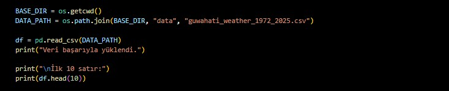

Bu adımda önce çalıştığım klasörü os.getcwd() ile aldım sonra os.path.join() kullanarak veri dosyasının tam yolunu birleştirdim. Böylece Python CSV dosyasının yolunu yani nasıl ulaşabileceğini net şekilde biliyor oldu. Ardından pd.read_csv() komutuyla dosyayı içeri aktardım ve dataFrame’e dönüştürdüm dataframe makine öğrenmesinde sıklıkla kullanılan bir yoldur çünkü Verinin tablo şeklinde gelmesi sayesinde hem sütunlara hem de değerlere rahatça erişebilmek veri işleme adımlarını oldukça kolaylaştırır. Son olarak da df.head(10) ile ilk 10 satıra baktım bu tamamen veri doğru yüklenmiş mi veya ekranda yansıyan verilerde hata ,eksiklik var mı diye kontrol etmek için yaptığım bir adım oldu.

### tarih formatı dönüştürülmesi

Verideki tarih sütunu yazı şeklindeydi yani bu da demek oluyor ki model için uygun değildi bu yüzden pd.to_datetime() ile bunu gerçek bir tarih formatına çevirdim ayrıca makine öğrenmesi tarih nesnesi ile çalışır bu bilgiler doğrultusunda veri setimde bulunan tarih sütununu ayrı ayrı yıl, ay ve gün bilgilerini çıkartıp yeni sütunlar oluşturdum. Bu adımı modelin daha güçlü ve düzgün öğrenebilmesi için yaptım.

### eksik değer tablosu
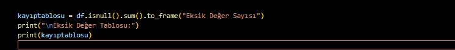

df.isnull().sum() komutu ile hangi sütunda kaç tane eksik değer var diye kontrol yaptım ve bu eksik değerleri toplayıp bir frame yani bu kod satırında yaptığım tabloya dönüştürdüm. Bu sayede çıktıda eksik değerleri görebildim.

### target Değişkeni ve features Belirleme
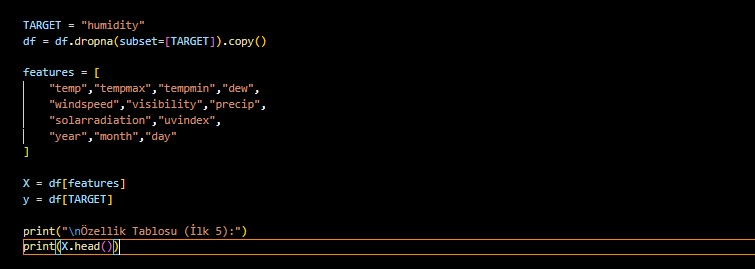

Tahmin edeceğim değişken humidity olduğu için onu target isimli bir değişken sabite atadım ve bu sütunda eksik olan satırları dropna fonksyonundan yararlanarak sildim bunu yapmamın sebebei ise eğer tahmin edilecek değerlerde nan yani boş değerler varsa bu makine öğrenmesini zorlaştırır ve tahmin değerlerini hesaplamada hatalar oluşturabilir daha sonrsındaa modele girdi olarak vereceğim sütunları bir features listesi adından bir liste halinde topladım (sıcaklık, rüzgâr hızı, maksimum sıcaklık , yıl, ay, gün vb.). Bunlara özellik deniyor ve model bu bilgileri kullanarak nemi tahmin edecek ve bu özellikler değişirse her birinin değiştikleri orana uygun olarak yeni bir değer tahmin edecek bu nedenle bu kod satırını yazdım. 

### test-train ayrıştırması
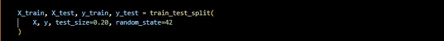

Bu kod satırında veri setini test ve train olmak üzere iki parçaya böldüm. X değişkeni modele girdi olarak vereceğim tüm bağımsız değişkenleri yani features listesinde belirttiğim değişkenleri içeriyor aynı zamanda y ise modelin tahmin etmeye çalıştığı hedef değişkendir yani humidity değeridir çoğu durumda odaklandığımız değişkendir (bağımlı değişken).
Bu ayırmayı yapmamın sebebi ise her makine öğrenmesi modelinin aynı mantıkla çalışıyor olmasıdır. Makine öğrenmesi modeli x içindeki değerleri kullanarak y yi tahmin eder,öğrenir.Eğer x ve y olarak ayrılmazsa model neyin girdi neyin çıktı olduğunu öğrenemez.

### korelasyon ısı haritası
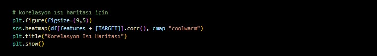

Bu adımda Seaborn kullanarak özellikler ile nem arasındaki ilişkiyi görselleştirdim bu grafik sonucunda özellikler ve target değişken arasında nasıl bir uyum veya ilişki var görselleştirebiliyoruz. Örneğin sıcaklık veya maksimum sıcaklık nemle güçlü bir ilişkiye sahipse bunu ısı haritasında kırmızıya yakın bir renk ile görebilyorum aynı şekilde de zayıfsa mavi tonlarındaki renkler ile görebiliyorum. Bu adımın var olmasının sebebi model kurmadan önce veriyi tanımak ve hangi özelliklerin gerçekten faydalı olduğunu anlamaktır sonuç çıktısında bunu hemen kolay bir şekilde analiz edebiliyorum. 

*MODELİMİN ISI HARİTASI*

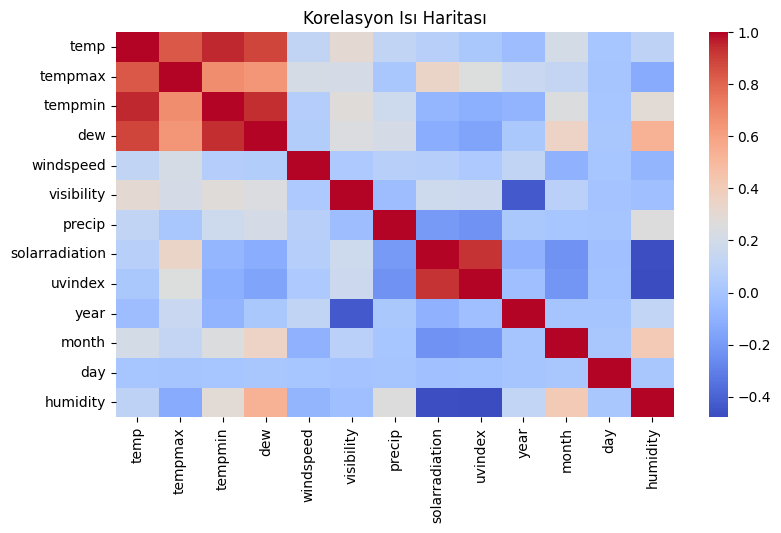

### random forest modeli kurulumu
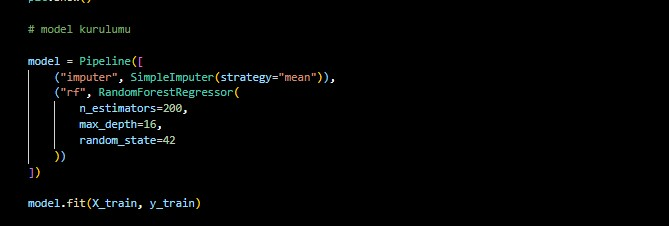

Bu adımda bir pipeline oluşturdum e bu pipeline yapısı sıraya alınmış bir şekilde farklı görevlerini yerine getirebilmemi sağladı. İlk olarak SimpleImputer ile eksik değerleri genel değerlerin ortalaması ile doldurdum çünkü modeller eksik veriyle çalışamaz çalışsa bile hatalı sonuç üretir. Ardından RandomForestRegressor modelini  pipelinea rf adıyla ekledim  yani aslında Random Forestı doğrudan pipeline zincirinin içine bağlamış oldum. Böylece model çalışırken önce eksik değerler otomatik olarak dolduruluyor, ardından çıkış olarak Random Forest modeli çalıştırılarak tahmin işlemi yapılıyor. Bu kod satırları ile pipelne yapısını kullanıp aynı anda hem bir taraftan preprocessing hem de model eklenimini yapmış oldum.

### performans ölçümü
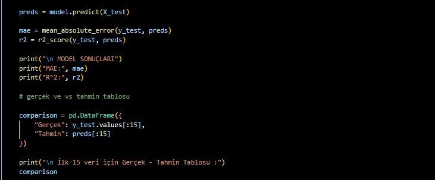

Bu adımda iki önemli performans belirleyici faktör kullandım. biri mae(Ortalama Mutlak Hata) diğeri ise r^2 (Başarı Skoru) mae modelin ne kadar hata yaptığını sayı olarak gösterir başarı skoru ise 0-1 arasında bir skor üreterek modelin veriyi ne kadar iyi açıklayıp açıklamadığını gösterir. Denediğim diğer regresyon modelleri ile kıyaslamamda da bu performans ölçütlerini kullandım ve çıktılara göre random forest modeline karar verdim.
  

### görselleştirme 
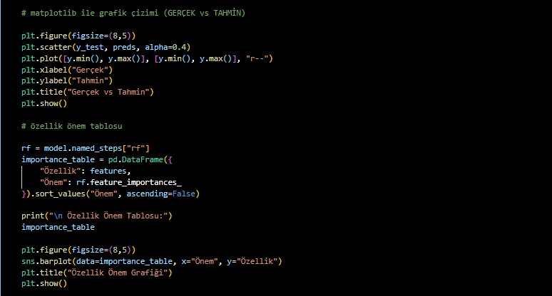

Bu bölümde ilk olarak modelimin ne kadar doğru tahmin yaptığını görsel olarak incelemek için bir scatter grafiği çizdim. Bu grafikte test setindeki gerçek nem değerlerini yatay eksene, modelin tahmin ettiği nem değerlerini ise dikey eksene yerleştirdim. Böylece her bir nokta aslında “model bu değeri böyle tahmin etmiş” anlamına geliyor. Grafiğe ayrıca kırmızı bir çizgi ekledim; bu çizgi modelin birebir doğru tahmin yaptığı ideal durumu temsil ediyor. Noktaların bu çizgiye yakın olması modelimin gerçeğe ne kadar yaklaştığını hızlı bir şekilde görmemi sağlıyor. Sonrasında modelin hangi özelliklere daha çok önem verdiğini öğrenmek için Random Forest’ın feature_importances_ değerlerini kullandım. Pipeline içindeki Random Forest modelini çıkartıp tüm özelliklerin önem skorlarını bir tabloya dönüştürdüm ve en önemliden en aza doğru sıraladım. Bu tabloyu oluşturmaktaki amacım, modelin nemi tahmin ederken hangi değişkenleri daha etkili bulduğunu anlamaktı. Örneğin model “dew” veya “tempmin” özelliklerine daha fazla önem veriyorsa bu, nem ile bu değişkenler arasında güçlü bir ilişki olduğu anlamına geliyor. Son olarak bu tabloyu bar grafik olarak çizdim çünkü görsel bir grafik sayesinde hangi özelliğin daha önemli olduğunu çok daha net ve anlaşılır bir şekilde görebiliyorum. Bu adımların hepsi benim için önemli çünkü hem modelin ne kadar iyi tahmin yaptığını görüyorum hem de modelin nasıl karar verdiğini, yani “iç mantığını” daha iyi çözmüş oluyorum. Bu sayede hem performansı hem de modelin çalışma şeklini çok daha rahat değerlendirebiliyorum.

*GERÇEK VS TAHMİN*

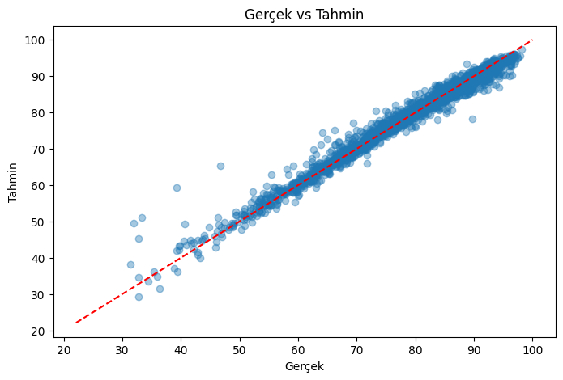

*ÖZELLİK ÖNEM TABLOSU*
**En önemli değişkenler:**

- dew 
- tempmin / tempmax  
- solarradiation  
- visibility  
- windspeed

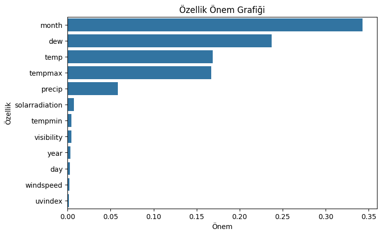

### modeli Kaydetme

    joblib.dump(model, "humidity_model.pkl")

Yukarıdaki kod satırı modeli kaydetmemize yarar yani bize bir sonraki aşamalarımızda bu kaydedilmiş modeli kullanmamızı sağlar. Burada da kullandığım gibi joblip.dump metodunu kullanarak modeli istediğimiz ismi vererek kaydedebliriz.

Yazdığım kod satırları ve açıklamalarım yukarıdakiler gibidir yazdığım kod genel olarak model bazlı modelin değerlerini ölçmek üzerine ilerlemiştir. Basit bir sample ekleyerek veya kullanıcıdan da bu sample örneğini alarak da modelim basit bir şekilde tahmin işlemini yapabilir.

## MODEL SEÇİMİ

Kullandığım veri setimde regresyon modeli seçmek için farklı modeller denedim ve bu modelelr arasından en iyi seçebilmek için de testler uyguladım bu testler modelin veri ile ne kadar uyuştuğunu ne kadar iyi tahminler yaptığını iyi tahmin olup olmadığını da grafikler çizerek ölçmeye çalıştım kullandığım testyöntemleri ilk olarak mae ve r^2 dir bu ölçümler bir modelin ne kadar hata yapıtğını ve veri ile uyumluluğunu ölçen genelgeçer kuramlardır ve devamında da her bir regresyn modeli için ayrı ayrı tahmin vs gerçek grafikleri çizdirdim bu grafikte olması gereken değerlerve modelin tahmin ettiği değerlerin birbirleri ile uyuşup uyumadığını ölçtüm.

**Linear Regression** 
                      
                        
                        
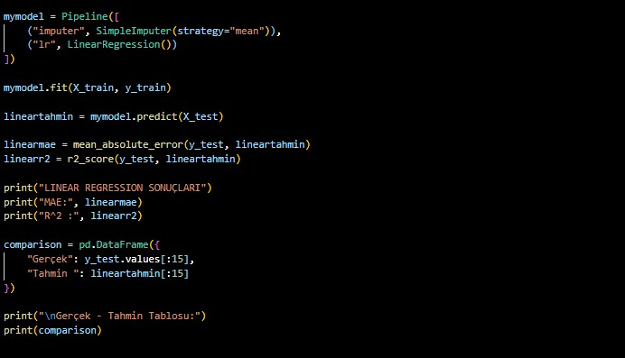

                        

Linear regresyonu projeme model olarak hangi kod satılarını kullanarak eklediğimi yukarıda görebilirsiniz.Öncelikle yine bir pipeline yapısı oluşturdum bana bu yapı aynı anda iki işi yapabilmemi sağlıyor preprocessing yani veri ön işleme olarak bildiğimiz eksik değerleri ortalama ile dolduruyor daha sonra ise modeli oluşturma aşamasına geçiyor. daha sonrasında da sırasıyla oluşturduğum modelin ismini kullanarak predict fonksiyonunu çağırdımve modelimin tahmin yapmasını sağladım ardından test için gerekli mae ve r^2 ifadelerini linear modeli için hesaplatıp yazdırdım bu değerleri devamında da asıl tablo kısmı olan kısma geçtim ve bir dataframe yapısı oluşturarak verideki gerçek y değerleri ve modelimin tahmin ettiği değeri bir tabloya yerleştirdim ve bu tabloyu ekranda gösterdim

Bu model bilindiği üzere genellikle doğrusal ilişkileri ele alan bir modeldir yukarıda bahsettiğim test içeriklerini uyguladığımda ise aşağıdaki sonuçları aldım 

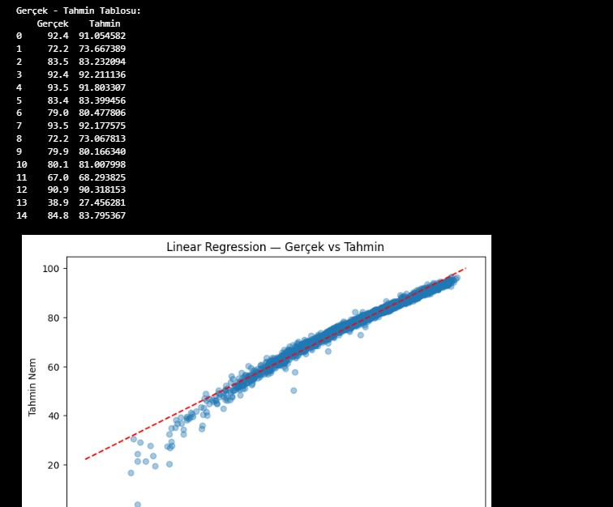

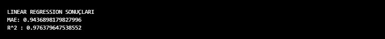

***MAE: 0.94*** bu sonuç bu modelin gerçek değerden ortalama 0.94 kadar saptığını gösteriyor kullandığım veri setindekş metorolojik gibi karışık verilerde ise bu gibi hatalar linear model için beklenilen türde hatalar olabilir çünkü veri setim doğrusal değil ve bu hata oranı da bu  model için beklenebilirdi.

***R²: 0.976*** bu değer ise varyans değeri olarak da biliniyor ve veri değişiminin açklanabilirliğini gösteriyor bu sonuca bakıldığında anlıyoruz ki bu veri modeli verinin yaklaşık %97 sini açıklayabiliyor ve bu da bir regresyon modeli için oldukça iyi bir değerdir. 

***GERÇEK VS TAHMİN*** bu tablom ise gerçek değerlerle tahminlerin uyuşmasını bir grafik üzerinde gösteriyor ortadaki kırmızı çizgi net tahmin yani doğru değerleri gösteriyor bu kırmızı doğrusal çizgiye uygunluk, yakınlık ne kadar çoksa veri tahmininin o kadar doğru olacağını biliyoruz bu grafikte de linear regresyon modelinin doğruluğunu net bir şekilde mae ve r^2 değerlerine uygun olarak görüyoruz ki kırmızı çizgi üzerindeki birleşme fazla ve yoğun olduğundan bu regresyon modeli doğru tahmin yapıyor diyebiliriz ve bu durum benim için şaşırtıcı bir durum oldu diyebilriz ama devamında yine de eklenebilecek ekstra karışık verlerle sorun yaratabileceğinden ve mae değerinin fazlalığından ötürü başka regresyon modellerini de inceledim.

**Polynomial Regression**
Bir diğer denediğim model ise çoklu ver için uygun olan polynomial regresyondur.

yYukadıdaki kod satırları ile bu regresyon modelini projeme dahil edip hesaplama yaptım bu regresyon modelinde lineardan farklı olarak ilk başta bir derece belirlemem gerekti bu derece oluşturulacak fonkaiyonumun derecesidir. Derecesini 2 seçmemin nedeni ise makine öğrenmesinde bu tarz veri setleri için gnellikle 2 seçiliyor olmasıdır hesaplaması hızlı ve aşırı öğrenmesi düşüktür. Devamında ise yine bir pipeline yapısı oluşturdum bu pipeline yapısı ilk eksik verileri ortalama ile doldurdu devamında ise erideki her özelliği 2. dereceden polinom haline getirdi son olarak  da yine bir linear regresyon yapısı kullandım çünkü polinom regresyon işin temelinde bir genişletilmiş bir linear fonksiyondur. Modeli eğitip, test ölçütlerini de hesaplattıktan sonra linear regresyonda yaptığım gibi dataframe yapısı ile bir tablo oluşturup ekranda gösterdim.

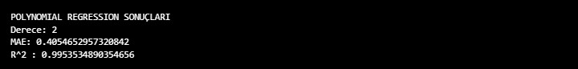

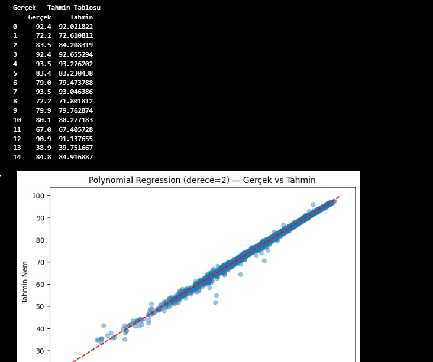

Test sonuçlarına baktığımızda ise şunu görüyoruz ki Bu sonuçlar, polinomsal regresyonda 2. derecenin veriyle neredeyse mükemmel uyum sağladığını gösteriyor: 

***MAE***  0.40 gibi çok küçük bir hata vermiştir ve bu bu veri seti için oldukça düşük bir orandır devamında ise  ***R²*** değerinin 0.995 olması modelin verideki varyansın %99.5’ini açıkladığını gösterir yani veri değerlerine uygunluk açısından oldukça yüksektir. ***Gerçek–tahmin tablosu*** da iki değerin her satırda birbirine çok yakın olduğunu kanıtlıyor. Grafikte noktaların kırmızı çizgiye olan yoğunluğuna baktığımızda gerçek ve tahminlerin ölçülen varyansa uygun olarak oldukça benzer yerlerde olduklarını görüyoruz. Bu modeli seçmememin nedeni ise veri setime eklenebilecek yeni özellik olduğunda bu regresyon modelinin hata verebileceğini düşünmemdir çünkü araştırmalarıma göre genel yapısı gereği 12den fazla özellik olduğunda düşük varyanslar ile karşılaşabiliriz bu da tahmin ve gerçek uyumunu bozabilir.

**SVR (Support Vector Regression)**

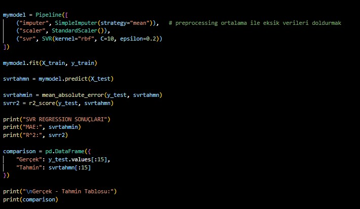

Denediğim bir diğer regresyon modeli olan svryi denemek için kodumda yaptığım değiişikliklerden bahsedecek olursam linear ve polinom regresyondan farklı olarak kullandığım yöntemlerden ilki svr mesafe tabanlı bir regreyon olduğu için stansardscaler kullanmaktır bu yöntem tüm özellikleri standarlaştırır ve ölçeklendirir eğer bu yapılmazsa özellikler farklı ölçeklerde olur e bu da modeli bozar. Devamında da yine aynı pipeline yapısı içerisinde svr içerisinde kernel ,c ve epsilon değerlerine yer verdim . Kernel eğrisel ilişkileri yakalar C daha sıkı yani verilere daha hassas modeli ayarlar ve  epsilon ise tolerans bölgesini belirler ceza almama bölgesini belirler.Devamında ise yine denediğim diğer regresyondakiler gibi mae ve r^2 hesaplaması yapılır ve ekrana tablo yansıtılır.

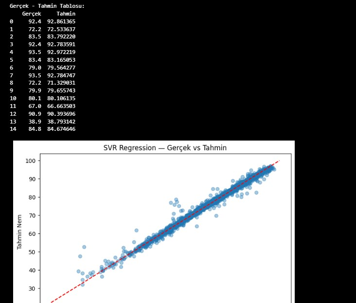

Svr regresyonun test sonuçlarını ve tabloyu incelediğimde ise polinom regresyona benzer ama daha düşük performans sonuçları aldım yaklaşık 0.5 ***mae*** ve 0.98 ***R^2*** varyans ile gerçekten iyi bir doğruluk yapısı sağlamıştır gerçek vs tahmin tablosuna baktığımda ise yoğunluk olarak doğruluk çizgisine yaklaşmıştır ama bu regresyonda daha fazla nokta mükemmel çizgiden uzaktadır ve bu durumdan ve svr regresyonun genel bir yapısı olan büyük verilerde yüksek maliyet gerektirdiğinden bu da işlemci üzerinde ekstra büyük bir yük , zaman ve maliyet gerektirdiğinden bu yöntem de seçimim olmamıştır.

**Decision Tree Regressor**

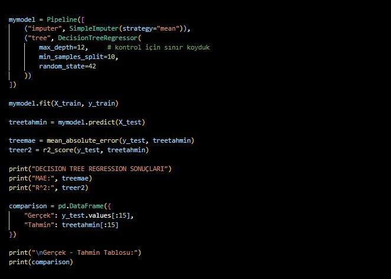

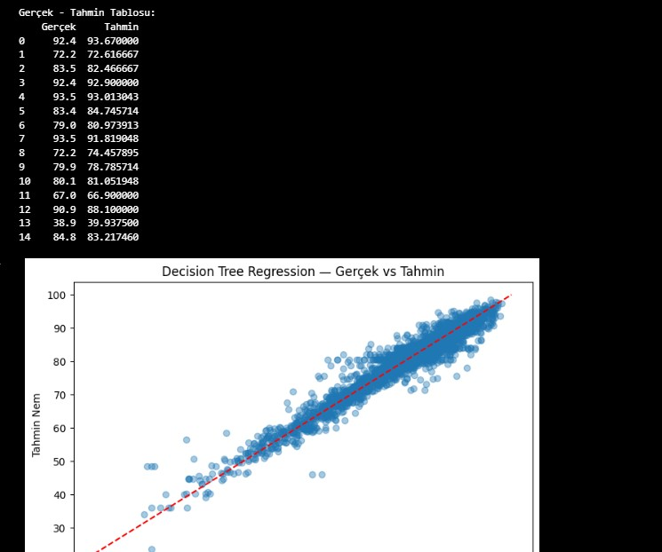

 yapısal olarak kolay anlaşılabilir ve hızlı çalışan bir algoritmadır fakat tek bir karar ağacına dayalı olması onu oldukça kararsız kılar. Veri içinde küçük değişiklikler yapıldığında bile modelin tamamen farklı karar yapıları üretmesi mümkündür. Ayrıca tek ağaç modelleri genellikle yüksek varyansa sahiptir bu da demek oluyor ki veriyi aşırı derecede ezberleyebilir ve genelleme performansında büyük düşüşler görülür. Bu sebeplerle Decision Tree, büyük ve gürültülü meteorolojik veri setleri için tıpkı benim kullandığım veri seti gibi veri setleri için güvenilir bir seçenek değildir.

**Random Forest**

Diğer bir adıyla da rassal ormanları olarak bildiğimiz bu model hem veri setim genişletildiğinde teorik olarak hem de test sonuçlarında önemli anlamda iyi sonuçlar veridiği için tercih ettim yukarıda kodun içine nasıl entegre edilidğini anlattım asıl olayı performans sonuçlara bakarsak eğer,

  MODEL SONUÇLARI
MAE: 0.8641747525457808
R²: 0.9781892749350534

Random forest modeli sonrası performans ölçütlerimin çıktısı yukarıdaki gibi olmuştur veri açıklanabilirliği olarak bildiğim veri uyumu varyans en yüksek random forest modelimde çıkmıştır. 1 yani mükemmel tahmine yakınlığı oldukça fazladır ve genel olarak random forest(rassal ormanları) yapısı gereği çoklu ağaç sistemi kullanması onun kararsızlığını azaltmasından bildiğimiz gürültülü yani eksik ve düzgün olmayan verilere dayanıklılığı ile bildiğimiz için hem düşüncede hem de pratikte en iyi yol olmuştur.

Bu özellikler nedeniyle üstte kullanılan ve denenen diğer algoritmalardan farklı olarak ****Random Forest**** açık ara en dengeli ve başarılı model olmuştur.

## SONUÇ

- 50 yıllık hava durumu verisi işlendi  
- Nem tahmini için anlamlı özellikler çıkarıldı  
- Farklı modeller karşılaştırıldı  
- Random Forest en yüksek başarıyı gösterdi  
 

